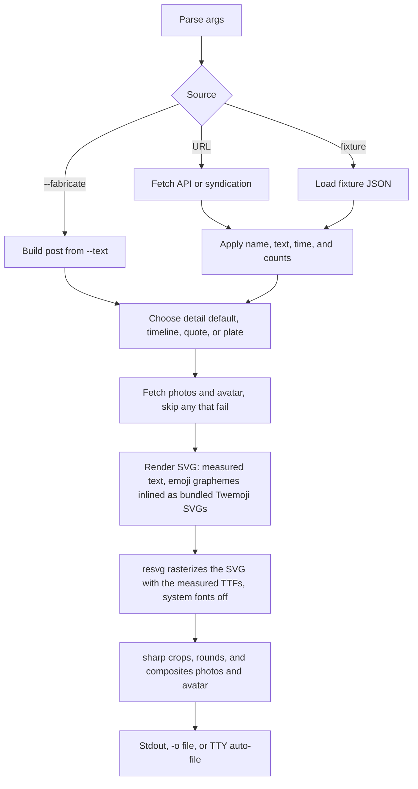

# Architecture

Args choose a source, overrides change the post, the view picks a drawing, and resvg plus sharp write the PNG (npm packages with prebuilt binaries; no ImageMagick since 0.9.26). Since 0.10.0, emoji graphemes (split with `Intl.Segmenter`) are drawn as inline Twemoji SVGs from `assets/emoji/twemoji.json.br`, at the x positions the text measurement reserved for them.

