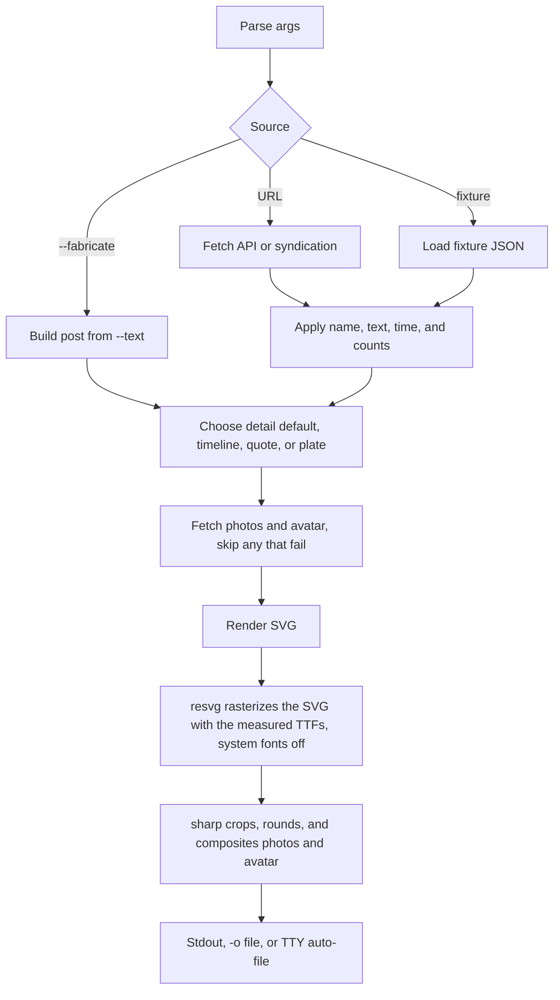

# Architecture

Args choose a source, overrides change the post, the view picks a drawing, and resvg plus sharp write the PNG (npm packages with prebuilt binaries; no ImageMagick since 0.9.26).

```mermaid
flowchart TD
  args[Parse args] --> source{Source}
  source -->|URL| fetch[Fetch API or syndication]
  source -->|fixture| fixture[Load fixture JSON]
  source -->|--fabricate| made[Build post from --text]
  fetch --> overrides[Apply name, text, time, and counts]
  fixture --> overrides
  made --> view[Choose detail default, timeline, quote, or plate]
  overrides --> view
  view --> images[Fetch photos and avatar, skip any that fail]
  images --> svg[Render SVG]
  svg --> resvg[resvg rasterizes the SVG with the measured TTFs, system fonts off]
  resvg --> sharp[sharp crops, rounds, and composites photos and avatar]
  sharp --> out[Stdout, -o file, or TTY auto-file]
```
